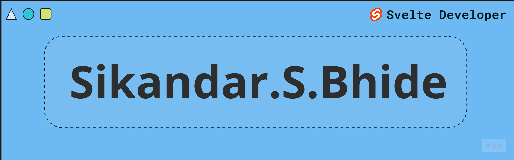

<!-- <h1 align="center">Hi 👋, I'm Sikandar Bhide</h1> -->
<!--  -->

# A Passionate Svelte & SvelteKit Developer From India

  

- 🔭 I’m currently working on **Super SV**

<h2 align="left">Linked-In & Leetcode Profile</h2>

<h2 align="left">Languages and Tools:</h2>

</a>            <a style="margin:5px"  href="https://sass-lang.com" target="_blank" rel="noreferrer">        

#### Recent Projects :

- [Svelte Animations](https://animation-svelte.vercel.app/) - High Quality Components build using Svelte, Tailwind CSS, Svelte Motion includes Magic UI, Aceternity UI, Luxe UI, Indie UI
- [Svelte Form Builder](https://svelte-form-builder.vercel.app) - Create forms with Shadcn Svelte, Superforms and schema within minutes.
- [Framer Ground](https://github.com/SikandarJODD/framer-ground-svelte) - Cool Animation build using Svelte, View Transition API
- [Super SV]() - Collection of Form Validation Examples build using Sveltekit, Superforms, Formsnap. Includes Client-Server Validation, Multi-Step Forms, File Validation, Debounce Search Forms and many more..
- [Youva Template](https://github.com/SikandarJODD/youva) - Project to learn Pagination, Caching, Filtering & Sorting, Debounce Search.., Build using Svektekit, Drizzle ORM, Supabase and Dummy JSON API. 
